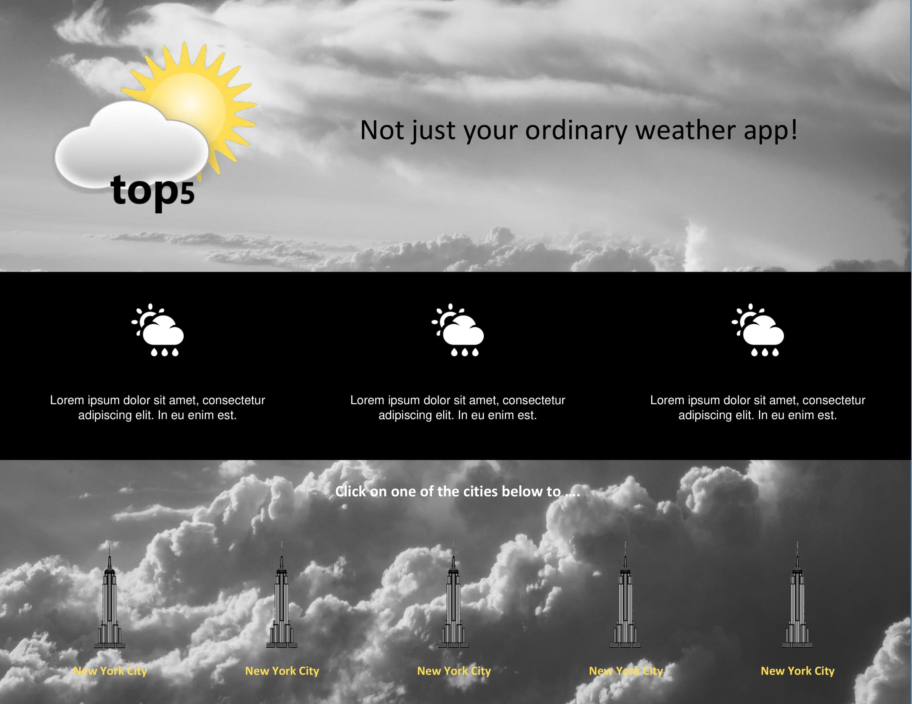

# 

### Table of Contents

[Project Description](#project-description)  
[Wireframes](#wireframes)  
[Using the App](#using-the-app)  
[Technologies Used](#technologies-used)  

## Project Description

Are you ever curious to see what the current weather is like in the top 5 cities in the world visited by tourists? Well here is your chance to get all the weather data you want to know for the 5 most popular cities in the world.

## Wireframes

## Using the App

The landing page will show the purpose of this app and a list of the 5 popular cities in the world. Users will be able to click on any one of the cities and view an informational chart based on their choice.

## Technologies Used

* React
* Open Weather Map API